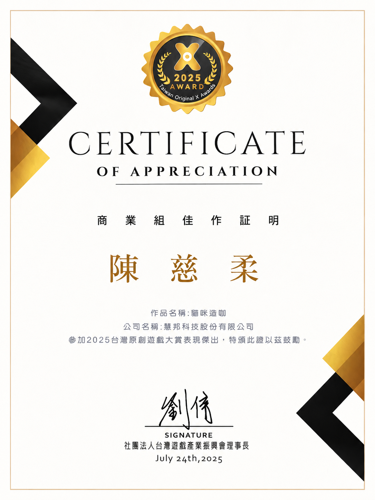
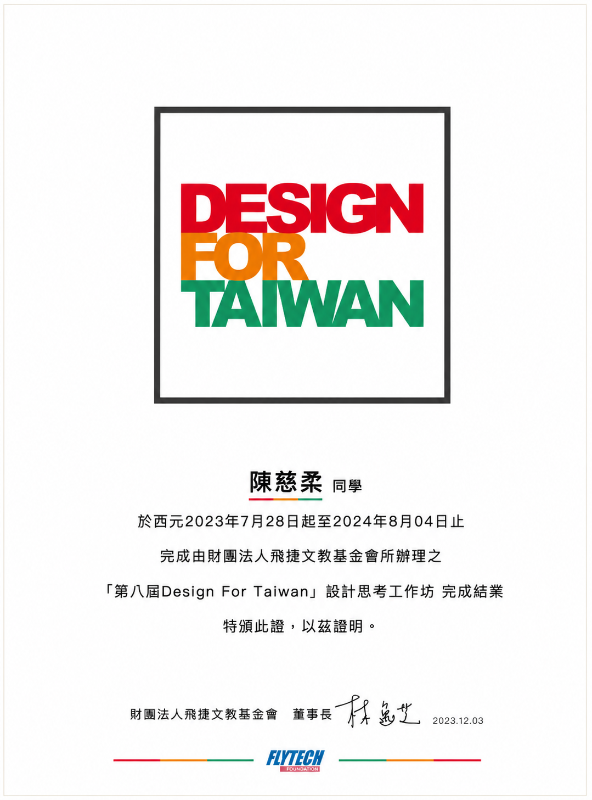
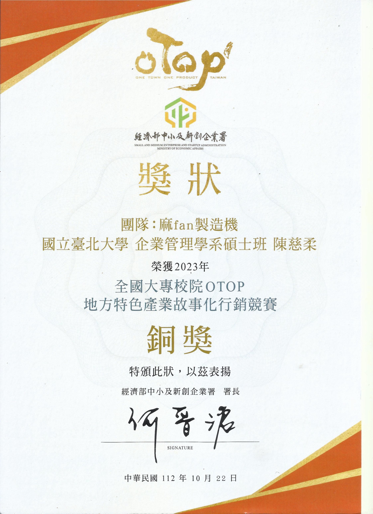

My experience spans impact evaluation, digital marketing, content strategy, data analysis, design thinking, and business competitions. Across these roles, I have developed a strong ability to connect data, strategy, and execution.

---

## Work Experience

::: {.timeline}

::: {.timeline-item}
### Impact Learning Intern

**YouthBuild Global**  
Boston, MA  
Jan 2026 – May 2026

- Evaluated 2025 annual survey data using Excel to support program learning and reporting.
- Created detailed charts and quantitative summaries to communicate key findings.
- Identified trends and actionable insights that contributed to program evaluation reports.
- Translated complex data into clear visualizations for internal decision-making.
- Strengthened skills in data cleaning, analysis, reporting, and nonprofit impact measurement.

#### Related Certificate

::: {.experience-cert-card}
[{fig-alt="Leveraging AI in Your Nonprofit Role Certificate"}](<certificates/certificates/Leveraging AI in Your Nonprofit Role.png>)

**Leveraging AI in Your Nonprofit Role**  
This certificate aligns with my interest in applying AI tools to support nonprofit communication, productivity, and impact evaluation.
:::

**Key Skills:** Excel, data visualization, survey analysis, reporting, impact evaluation
:::

::: {.timeline-item}
### Digital Marketing Intern

**Gamesofa Inc.**  
Taipei, Taiwan  
Jul 2024 – Jun 2025

- Created digital marketing content and managed two social media channels: Facebook and Instagram.
- Grew followers from **0 to 9,000 within 9 months** through content planning and engagement strategy.
- Applied SEO and digital marketing techniques to increase audience reach and interaction.
- Generated **9,650 total video views** through short-form content and campaign execution.
- Analyzed backend performance data and prepared monthly reports on key metrics.
- Contributed to the “CatCafe” project, which received recognition at the **2025 Taiwan Original X Award**.

#### Related Award

::: {.award-card}
[{fig-alt="Gamesofa CatCafe Project Award Certificate"}](awards/gamesofa-catcafe-award.png)

### CatCafe Project Recognition

**2025 Taiwan Original X Award — Business Category**
Received a Certificate of Appreciation for contributing to the **CatCafe** project, which recognized creative business value, digital engagement, and project execution.
:::

**Key Skills:** Social media marketing, SEO, content strategy, performance reporting, campaign analysis
:::

:::

---

## Leadership & Competition Experience

::: {.timeline}

::: {.timeline-item}
### Anti-Cyberbullying Solution Design

**FlyTech Foundation**  
Jul 2023 – Aug 2024

- Led a team in applying design thinking to develop an anti-cyberbullying solution.
- Created user personas and explored user pain points through structured problem analysis.
- Participated in prototyping, testing, and presentation development.
- Presented the solution at an exhibition with **100+ participants**.
- Won the **Popularity Award** for audience engagement and solution creativity.

#### Related Award

::: {.award-card}
[{fig-alt="DFT Popularity Award Certificate"}](awards/dft-popularity-award.png)

### Popularity Award

**Design Thinking / Anti-Cyberbullying Solution**

Won the **Popularity Award** for presenting an empathetic and creative anti-cyberbullying solution. The project applied design thinking, user persona development, prototyping, and public exhibition presentation.
:::

**Key Skills:** Design thinking, user research, teamwork, presentation, prototyping
:::

::: {.timeline-item}
### OTOP Marketing Competition

**Ministry of Economic Affairs, R.O.C.**  
Mar 2023 – Oct 2023

- Led a team in developing a marketing strategy for a local specialty product.
- Conducted market research and competitive analysis to refine campaign direction.
- Developed branding and storytelling strategies to strengthen product positioning.
- Received the **Bronze Award** for innovative marketing and campaign execution.

#### Related Award

::: {.award-card}
[{fig-alt="OTOP Marketing Competition Bronze Award Certificate"}](awards/otop-bronze-award.png)

### Bronze Award

**OTOP Marketing Competition**

Achieved the **Bronze Award** for developing an innovative marketing strategy, competitive analysis, branding concept, and storytelling approach for a local specialty product.
:::

**Key Skills:** Market research, branding, competitive analysis, storytelling, team leadership
:::

:::

---

## Core Professional Strengths

::: {.card-grid}
::: {.feature-card}
### Analytical Thinking

Able to organize data, identify trends, and communicate findings clearly.
:::

::: {.feature-card}
### Marketing Execution

Experienced in content planning, social media growth, SEO, and performance tracking.
:::

::: {.feature-card}
### Cross-Functional Collaboration

Comfortable working with teams across different backgrounds, goals, and responsibilities.
:::
:::

---

## Professional Development

In addition to academic and professional experience, I continuously build technical knowledge through online learning and certification programs.

::: {.experience-cert-grid}

::: {.experience-cert-card}
[{fig-alt="AWS Academy Cloud Foundations Certificate"}](<certificates/certificates/AWS Academy Graduate - Cloud Foundations.png>)

### AWS Academy Graduate - Cloud Foundations

Built foundational understanding of cloud computing, AWS services, cloud security, and cloud-based business applications.
:::

::: {.experience-cert-card}
[{fig-alt="AWS Academy Generative AI Foundations Certificate"}](<certificates/certificates/AWS Academy Graduate - Generative AI Foundations.png>)

### AWS Academy Graduate - Generative AI Foundations

Developed foundational knowledge of generative AI, AI applications, and responsible AI concepts.
:::

::: {.experience-cert-card}
[{fig-alt="TBF Certificate"}](<certificates/certificates/TBF Certificate.png>)

### TBF Certificate

Represents additional professional development and business-related learning experience.
:::

:::